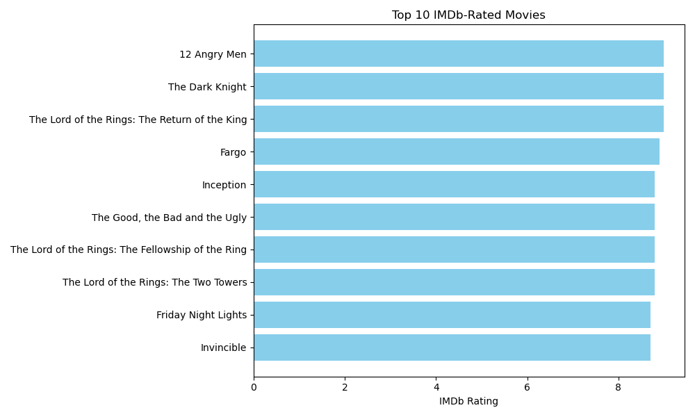
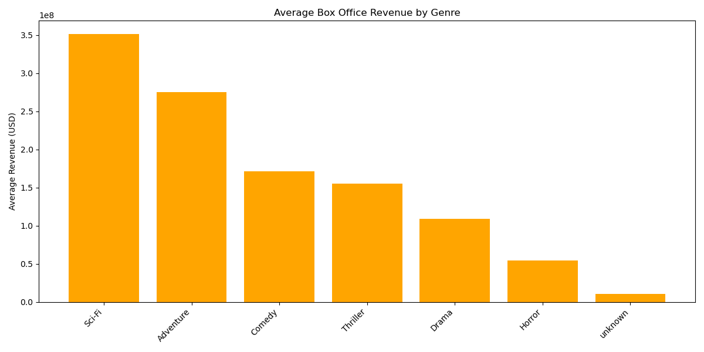
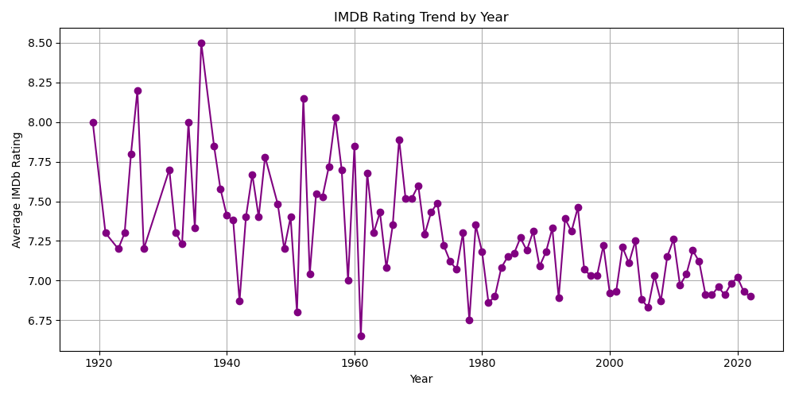

# movie-sql-analysis
SQL &amp; Python analysis of movie dataset including ratings and box office collections
# 🎬 Movie SQL Analysis: Box Office & Ratings Insights 

This project explores and analyzes a movie dataset using both **Python (Pandas)** for data cleaning and **SQL** for data querying. The goal is to uncover trends and insights about box office collections, IMDb ratings, and other key attributes of movies.

---

## 📁 Files in This Project

- `imdb_data_cleaning.ipynb` – Data cleaning and preparation using Python & Pandas
- `sql_analysis.ipynb` – SQL-based querying and visualization
- `BoxOfficeCollections_cleaned.csv` – Cleaned dataset
- `IMDB_box_office.db` – SQLite database generated from the cleaned data
- `BoxOfficeCollections_raw.csv` – Original raw dataset (for reference only)

---

## 🧼 Step 1: Data Cleaning (Python & Pandas)

Key cleaning steps included:

- Gaining an initial understanding of the dataset structure and value types  
- Identifying missing values across all columns  
- Detecting and removing duplicate rows; standardizing column names for consistency  
- Dropping rows where more than 6 columns contained null values  
- Filling missing values with `'Unknown'` for the `director`, `cast`, and `imdb_genre` columns  
- Replacing null values in the `time_minute` column with a default runtime of **60 minutes**  
- Analyzing missing values in the `votes`, `box_office_collection`, `imdb_rating`, and `metascore` columns using descriptive statistics  
- Filling those numerical missing values using **median values grouped by genre**

---

## 🧠 Step 2: SQL Analysis

The cleaned data was loaded into a SQLite database (named- 'IMDB_box_office.db') and queried using SQL via Python (`sqlite3` + `pandas`). Below are the key analyses performed:

- ⭐ **Top-rated movies by IMDb score**  
  Extracted top 10 movies with the highest IMDb ratings.  
  ➤ Notable titles: *12 Angry Men*, *The Dark Knight*
  
  
- 💰 **Revenue trends across genres**  
  Grouped by `imdb_genre` to calculate average box office revenue.  
  ➤ Sci-Fi and Adventure genres had the highest average collections.
  
  
- 📅 **Count of movies per year**  
  Showed number of movies released each year.  
  ➤ Peak movie releases around 2016–2019.

- 📈 **Average IMDb Rating by Year**  
  Observed fluctuations in average IMDb ratings over the years, with a slight increase around 2020 followed by a mild decline  
   
  
- ⚖️ **Low-rated but high-earning movies**  
  Queried movies with IMDb rating < 6 but earned > $100M.  
  ➤ Highlights commercially successful films that received low critical ratings, possibly due to strong branding or fan following.

- 🎭 **Top genres by movie count**  
  Displayed the most represented genres in the dataset.  
  ➤ Comedy and Drama genres were most frequent.  

> All queries and charts are executed in [`sql_analysis.ipynb`](./sql_analysis.ipynb)

---

## 📊 Visualizations

Bar charts and line graphs were created using SQL + Pandas + Matplotlib to support each query insight.

---

## 🛠️ Tools & Technologies

- Python
- Pandas
- SQLite
- SQL (via 'sqlite3')
- Matplotlib
- Jupyter Notebook

---

## 💡 Key Learning & Purpose

The project was built as part of my portfolio to showcase:
- Proficiency in data wrangling and preprocessing with Pandas 
- Ability to build and query a SQL database
- Data storytelling using Python and SQL
- Preparing datasets for real-world analytics scenarios

---

## 📌 Future Work

- Expand to a multi-table relational project (e.g., including actors, directors)
- Add more complex joins, aggregations, and visualizations

---

## 🧾 Dataset Overview

📄 <strong>Click to view dataset details and column descriptions</strong>

### Column Descriptions (`BoxOfficeCollections_cleaned.csv`)

| Column Name             | Description                                                                 |
|-------------------------|-----------------------------------------------------------------------------|
| `movie`                 | Title of the movie                                                          |
| `year`                  | Release year of the movie                                                   |
| `score`                 | Original critic score (e.g., Rotten Tomatoes or similar, on a 0–100 scale)  |
| `adjusted_score`        | Weighted or normalized version of `score`                                   |
| `director`              | Director of the movie                                                       |
| `cast`                  | Main cast members (comma-separated)                                         |
| `consensus`             | Brief plot summary or critic consensus                                      |
| `box_office_collection` | Total worldwide box office earnings in USD                                  |
| `imdb_genre`            | Primary genre listed on IMDb (e.g., Comedy, Action)                         |
| `imdb_rating`           | IMDb rating (scale: 0–10)                                                   |
| `metascore`             | Metacritic score (0–100)                                                    |
| `time_minute`           | Runtime of the movie in minutes                                             |
| `votes`                 | Total number of IMDb user votes                                             |

### 🧪 Sample Preview

| movie              | year | score | imdb_rating | box_office_collection |
|--------------------|------|-------|-------------|------------------------|
| Hot Rod            | 2007 | 39    | 6.7         | 14,371,564             |
| Game Night         | 2018 | 85    | 6.9         | 117,378,084            |
| The First Wives... | 1996 | 49    | 6.4         | 181,489,203            |

---

## 📎 Dataset Credit

- [Kaggle - Box Office Collections Dataset](https://www.kaggle.com/datasets/anotherbadcode/boxofficecollections)

---
